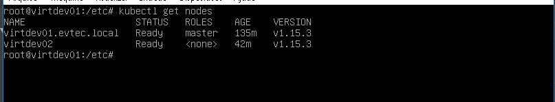

## Ingrassando um nó escravo no cluster kubernetes.

```
kubeadm join 10.0.2.100:6443 --token 9e0xeu.s0if3... --discovery-token-ca-cert-hash sha256:3a328e56729515d...
```

> Após este comando podemos ver no master os nós em execução
```
kubectl get nodes
```

A Saída deve ser parecida com essa:



> Utilize o token e a chave que recebeu ao iniciar o nó mestre.

Continue para [Usando o cluster](using.md)