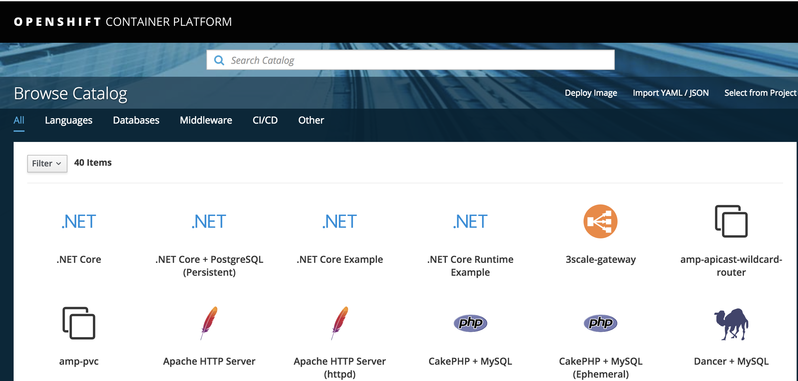

# Openshift

> Openshift é um projeto que executa o kubernetes por baixo dos panos para facilitar o uso.



Versão funcionando:
Docker: 19.03.1
Kubetcl: v1.9.1+a0ce1bc657
Openshift: v3.9.0+191fece

#### Instalação (Necessário docker instalado).

Download do openshift:
```
Versão 9 - Funcionando
wget -c https://github.com/openshift/origin/releases/download/v3.9.0/openshift-origin-client-tools-v3.9.0-191fece-linux-64bit.tar.gz


Versão 10 - ?
wget -c https://github.com/openshift/origin/releases/download/v3.10.0/openshift-origin-client-tools-v3.10.0-dd10d17-linux-64bit.tar.gz


Versão 11 - Não consegui colocar para funcionar "erro timeout"
wget -c https://github.com/openshift/origin/releases/download/v3.11.0/openshift-origin-client-tools-v3.11.0-0cbc58b-linux-64bit.tar.gz

```

Instalação:
```
cp oc /usr/local/bin
```

Configuração: ** /etc/docker/daemon.json **
```
{
    "insecure-registries": [ "172.30.0.0/16" ]
}
```

Executando o openshift:
```
oc cluster up --public-hostname=192.168.239.122
```

Acessando via browser externo
```
https://192.168.239.122:8443
```
