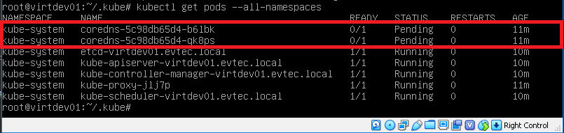
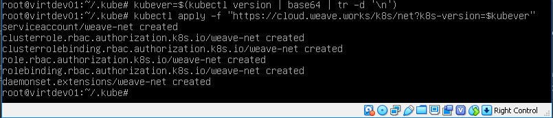

# Iniciando o nó mestre

- No Master execute **kubeadm init** para inicializar o cluster pela primeira vez.
```
# kubeadm init

ou

# kubeadm init --pod-network-cidr=10.244.0.0/16 --apiserver-advertise-address=10.0.10.100 --kubernetes-version="1.21.1"
```

install Kubernetes Cluster with Kubeadm
kubelet doesn’t appreciate the command-line options anymore (these are deprecated). Instead, I suggest to create a configuration file, say ‘kubelet.yaml’ with following content.

```
$ vi kubelet.yaml
apiVersion: kubeadm.k8s.io/v1beta3
kind: InitConfiguration
---
apiVersion: kubeadm.k8s.io/v1beta3
kind: ClusterConfiguration
kubernetesVersion: "1.23.1" # Replace with your desired version
controlPlaneEndpoint: "k8s-master"
---
apiVersion: kubelet.config.k8s.io/v1beta1
kind: KubeletConfiguration
```

```
$ sudo kubeadm init --config kubelet.yaml
```


> A Saida será algo como:
```sh
[init] Using Kubernetes version: v1.21.1
[preflight] Running pre-flight checks
[preflight] Pulling images required for setting up a Kubernetes cluster
[preflight] This might take a minute or two, depending on the speed of your internet connection
[preflight] You can also perform this action in beforehand using 'kubeadm config images pull'

[kubelet-start] Writing kubelet environment file with flags to file "/var/lib/kubelet/kubeadm-flags.env"
[kubelet-start] Writing kubelet configuration to file "/var/lib/kubelet/config.yaml"
[kubelet-start] Activating the kubelet service
[certs] Using certificateDir folder "/etc/kubernetes/pki"
[certs] Generating "ca" certificate and key
[certs] Generating "apiserver-kubelet-client" certificate and key

...

[bootstraptoken] configured RBAC rules to allow certificate rotation for all node client certificates in the cluster
[bootstraptoken] creating the "cluster-info" ConfigMap in the "kube-public" namespace
[addons] Applied essential addon: CoreDNS
[addons] Applied essential addon: kube-proxy

Your Kubernetes master has initialized successfully!

To start using your cluster, you need to run the following as a regular user:

  mkdir -p $HOME/.kube
  sudo cp -i /etc/kubernetes/admin.conf $HOME/.kube/config
  sudo chown $(id -u):$(id -g) $HOME/.kube/config

You should now deploy a pod network to the cluster.
Run "kubectl apply -f [podnetwork].yaml" with one of the options listed at:
  https://kubernetes.io/docs/concepts/cluster-administration/addons/

Then you can join any number of worker nodes by running the following on each as root:

kubeadm join 10.0.2.100:6443 --token d1dyaj.31zxywbg93s1ywjy --discovery-token-ca-cert-hash sha256:71a91721595fde66b6382908d801266602a14de8e16bdb7a3cede21509427009

```
> Anote o token e a chave para usar nos nós escravos.

Para executar o kubernetes copie o arquivo **admin.conf**
```
mkdir -p $HOME/.kube
cp -i /etc/kubernetes/admin.conf $HOME/.kube/config
chown $(id -u):$(id -g) $HOME/.kube/config
```

Rode o comando abaixo para verificar o status do cluster
```
kubectl get pods --all-namespaces
```
> A Saida deve estar assim:


Crie uma rede virtual ( namely, calico, canal, flannel, weave )

Exemplo Calico:
```sh
kubectl apply -f https://raw.githubusercontent.com/projectcalico/calico/v3.28.2/manifests/calico.yaml
```

Exemplo rede flannel:
```bash
kubectl apply -f https://raw.githubusercontent.com/flannel-io/flannel/v0.20.2/Documentation/kube-flannel.yml
```

Exemplo rede weave:
```
export kubever=$(kubectl version | base64 | tr -d '\n')
kubectl apply -f "https://cloud.weave.works/k8s/net?k8s-version=$kubever"

kubectl apply -f https://github.com/weaveworks/weave/releases/download/v2.8.1/weave-daemonset-k8s.yaml
```

> A saída deve ser igual a essa:


> Após esse procedimento os **coredns** devem estar "running"

