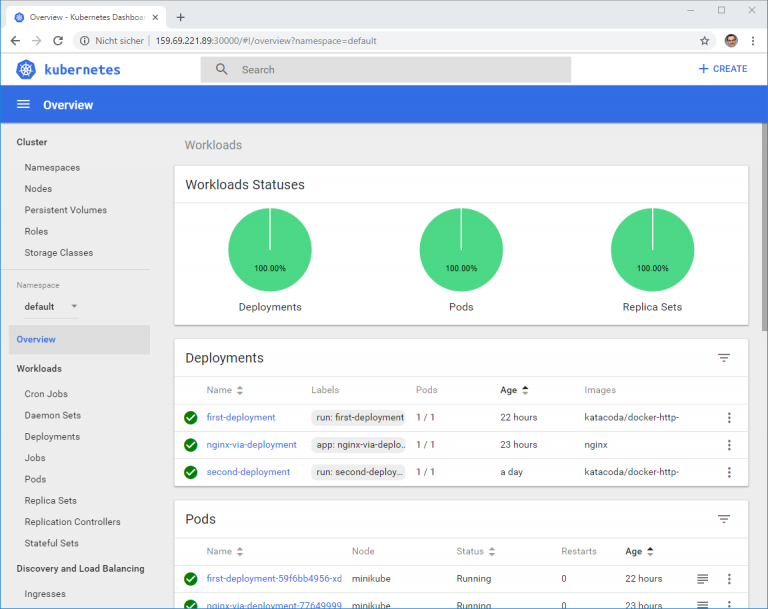

# Minikube

> Minikube é um projeto para teste, ele utiliza um único nó para executar o kubernetes, assim facilita o aprendizado.

Versão funcionando:
```
Docker: 19.03.2
Minikube: v1.3.1
Kubetcl: v1.15.2
```

#### Instalação ( Necessário docker instalado. )

Download do minikube:
```
https://github.com/kubernetes/minikube/releases/
```
Instalação:

- Instalar o kubectl:
```
curl -LO https://storage.googleapis.com/kubernetes-release/release/v1.17.0/bin/linux/amd64/kubectl
mv kubectl /usr/local/bin/
chmod +x /usr/local/bin/kubectl
```

- Então instalar o minikube

```
curl -Lo minikube https://storage.googleapis.com/minikube/releases/latest/minikube-linux-amd64 
mv minikube /usr/local/bin/
chmod +x /usr/local/bin/minikube
```

/etc/docker/daemon.json: nao utilizado

Executando o minikube:
```
minikube start
```

Executando o dashboard
```
minikube dashboard
```

Acessando o dashboard externamente
```
kubectl proxy --address='0.0.0.0' --disable-filter=true
```

Acessando via browser externo
```
http://your_api_server_ip:8001/api/v1/namespaces/kube-system/services/http:kubernetes-dashboard:/proxy/
```

