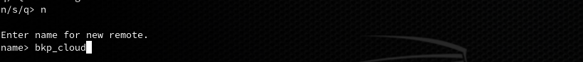
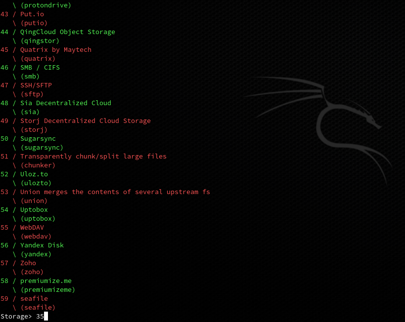

# Postgres

#### Tranferencia on-the-fly

```bash
pg_dump -v -C <nome-banco> | psql -h <nome-novo-host ou ip-novo-host> -U postgres <nome-banco>
```

#### Tranferencia on-the-fly para outro banco na mesma maquina **remover tag '-C'**

```bash
pg_dump -v <nome-banco> | psql -U postgres <nome-banco>
```

## Realizar Backup para o OneDrive

#### Instalar e configurar Rclone

Instalar ferramenta rclone e fuse no Debian

```
apt install rclone fuse
```

Configurar rclone com uma conta onedrive
executar como root:






#### Criar Scripts
```bash

```
- Criar Variavel de ambiente PGPASSWORD
